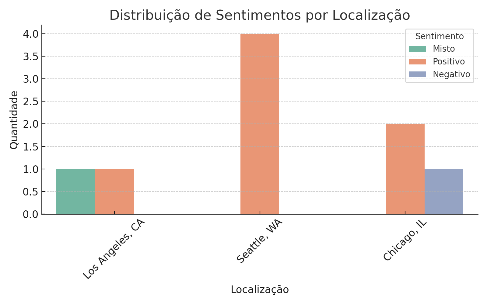
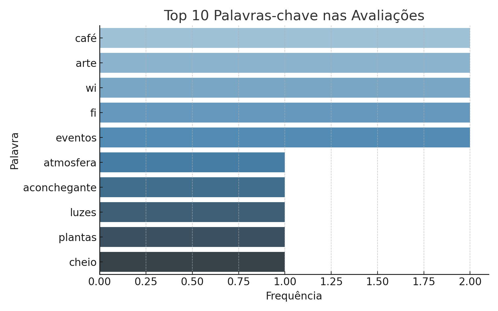

# 🧠 AI Search — Protótipo Local

Este projeto simula um sistema de busca inteligente utilizando dados fictícios de avaliações de clientes da cafeteria fictícia *Fourth Coffee*.

---

## 📁 Estrutura

- `/dados/`: feedbacks originais
- `/informacoes/`: dados enriquecidos (análise de sentimento, frases-chave)
- `/conhecimento/`: resultados de buscas simuladas
- `/prints/`: gráficos e capturas de tela
- `main.py`: script principal
- `setup_projeto.py`: script de inicialização
- `requirements.txt`: bibliotecas necessárias
- `LICENSE`: licença MIT

---

## 🚀 Como executar

```bash
pip install -r requirements.txt
python -m textblob.download_corpora
python setup_projeto.py
python main.py
```

---

## 🔍 Funcionalidades

- Análise de sentimento com TextBlob
- Extração de frases-chave
- Busca por palavra-chave
- Exportação em CSV e TXT
- Gráficos gerados automaticamente

---

## 📊 Gráficos

### Sentimentos por Localização


### Palavras-chave mais mencionadas


---

## 📄 Tabela de Reviews

Acesse: [`feedbacks_reviews_tabela.csv`](informacoes/feedbacks_reviews_tabela.csv)

---

## 🧪 Tecnologias

- Python 3
- Pandas
- TextBlob

---

## 👤 Autor

Douglas Castilho da Silva  
Aluno de TI - Univesp
RA: 2109080

---

## 🪪 Licença

MIT — sinta-se livre para usar, estudar e modificar.
